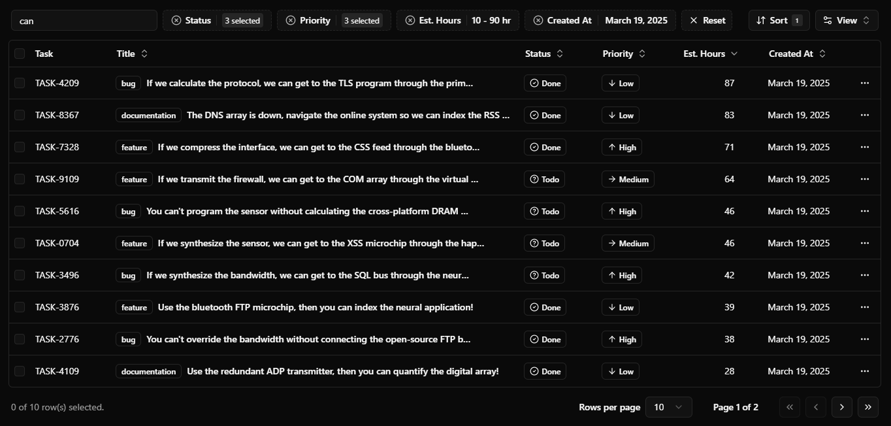

# [Shadcn Table](https://shadcn-table-alt.vercel.app)

This is a Shadcn table component with server-side sorting, filtering, and pagination. It is bootstrapped with `create-t3-app`.

[](https://shadcn-table-alt.vercel.app)

## Tech Stack

- **Framework:** [Next.js](https://nextjs.org)
- **Styling:** [Tailwind CSS](https://tailwindcss.com)
- **UI Components:** [shadcn/ui](https://ui.shadcn.com)
- **Table package:** [TanStack/react-table](https://tanstack.com/table/v8)
- **Database:** [PlanetScale](https://planetscale.com)
- **ORM:** [Drizzle ORM](https://orm.drizzle.team)

## Features

- [x] Server-side pagination
- [x] Server-side sorting
- [x] Server-side filtering
- [x] Dynamic debounced search based on the searchable columns provided
- [x] Dynamic faceted-filtering based on the filterable columns provided

## Running Locally

1. Clone the repository

   ```bash
   git clone https://github.com/sadmann7/shadcn-table
   ```

2. Install dependencies using pnpm

   ```bash
   pnpm install
   ```

3. Copy the `.env.example` to `.env` and update the variables.

   ```bash
   cp .env.example .env
   ```

4. Start the development server

   ```bash
   pnpm run dev
   ```

5. Push the database schema

   ```bash
   pnpm run db:push
   ```

## Codebase Overview

Watch the codebase overview video on [YouTube](https://www.youtube.com/watch?v=BsvjF5Y6-C8&t=1s).

Consider subscribing to [Kavin's YouTube channel](https://www.youtube.com/@livecode247) for more videos.

## How do I deploy this?

Follow the deployment guides for [Vercel](https://create.t3.gg/en/deployment/vercel), [Netlify](https://create.t3.gg/en/deployment/netlify) and [Docker](https://create.t3.gg/en/deployment/docker) for more information.

## How to use the data-table component

1. Clone the Repo

```bash
   git clone https://github.com/sadmann7/shadcn-table
```

OR

```bash
   git clone https://github.com/arvind-iyer-2001/shadcn-table
```

2. Copy the following folders and files into your project (configured with ) at the exact specific locations

- `src/components/data-table`
- `src/db/index.ts`
- `src/hooks`
- `src/lib`
- `src/types`

Also install the required shadcn components and other required packages with the following commands:

```bash
pnpm dlx shadcn-ui@latest init

pnpm dlx shadcn-ui@latest add button badge checkbox command dialog dropdown-menu input popover select separator skeleton table toast

pnpm add drizzle-orm @planetscale/database @tanstack/react-table zod drizzle-zod sonner @t3-oss/env-nextjs
pnpm add -D drizzle-kit dotenv-cli tsx
```

3. Configure your Environment Variables
   Then set up the Database URL, for this example, we're using PlanetScale MySQL2 Database. Our schemas will also be made using this.

4. Database Actions: For this you can use any ORM of your choice, but for the sake of this particular example, we're using [Drizzle ORM](https://orm.drizzle.team) and [PlanetScale](https://planetscale.com).

As an example, lets use the `tasks` table.

- Create the Table Schema at `@/db/schema.ts`
- Create the associated zod validations `@/lib/validations/tasks.ts` file

5. Setting up the Table

- Start with creating a route group for the tasks table - `@/app/(tasks)/`
- Inside this create `layout.tsx` and `loading.tsx` files, if needed
- Copy the contents of the `(tasks)` directory into your project wherever needed.
- Modify each of the files according to your database table
  - Modify the required actions for querying and mutating data in the folder `/(tasks)/_actions` in the `queries.ts` and `mutations.ts`
  - Modify the `/(tasks)/_components/task-table-column-def.tsx` file to define the column header, the column based actions and the presentation of the data in each column.
  - Modify the `/(tasks)/_components/task-table-selected-action-controls.tsx` file to define the the selected rows based actions, like deleting and modifying a group of rows.
  - Modify the `/(tasks)/_components/task-table-shell.tsx` file to reference the schemas, types and database actions to be used in the table.
    (Components and Data that have to be memoized must be declared here, because it can not be done in a React Server Component)
  - Modify the `/(tasks)/page.tsx` file to fetch the required search parameters of the page, and query the data on the Server.
